# Door Lock - DE1 Project
School project - A door lock with an Arty board

### Team members

- Medek Petr
- Navrátil Jiří
- Niederle Vojtěch
- Nimrichter Filip 

[Link to our GitHub project folder](https://github.com/GeorgeNavratil/Door_Lock-DE1_Project)

### Project objectives

Making a Door Lock system with:

- 4-digit PIN terminal
- 4-digit 7-segment display
- 4x3 push buttons keyboard
- relay for door lock control

## Hardware description

Whole system will be mainly run on an [Arty A7-35T board](https://store.digilentinc.com/arty-a7-artix-7-fpga-development-board/) with a custom number keypad keyboard, a 4-digit display and a relay to lock the door. The keyboard and display with relay are solved at two other external boards. On the board with display and relay are two LED diodes to signal if the lock is open or not and two terminal blocks, one for the lock and the second one for the external source which is there in case we would need more current to open a bigger lock (safe or something like that). This board can be connected directly into pmod ports on Arty A7. The keyboard will be connected into the Arduino/chipKIT shield connectors IO0-IO11. 

#### Keyboard

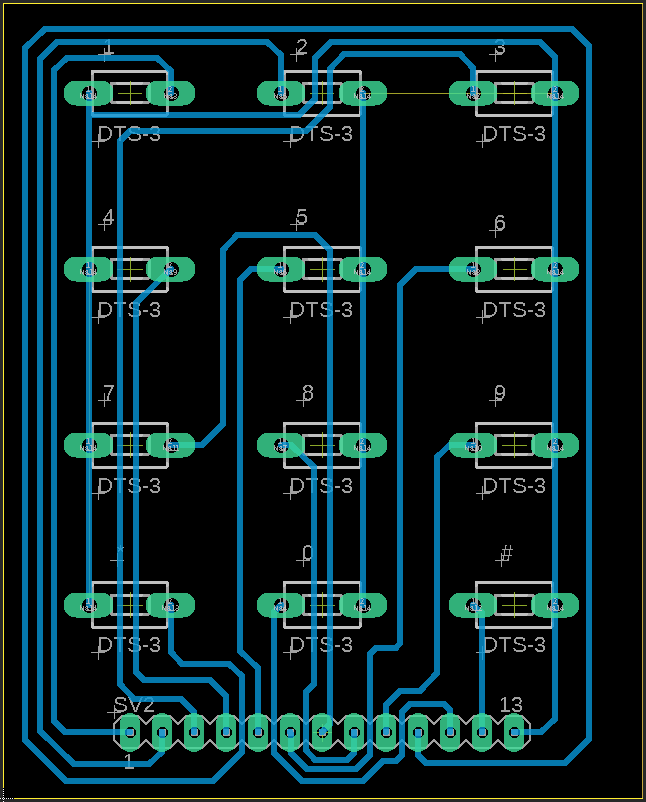

#### Display

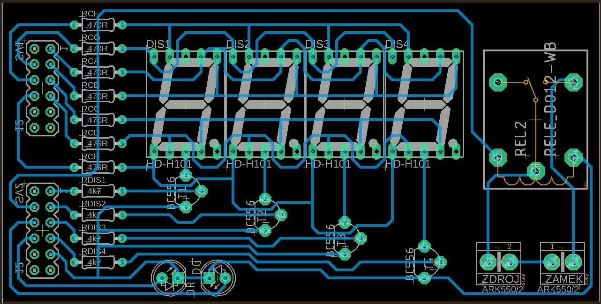

## VHDL modules description and simulations

### Keyboard

**Module**: The keyboard is solved in the simplest way. Buttons are connected to 3,3V  power supply and every single button is connected to Arduino/chipKIT shield connectors IO0-IO11. The module recognizes, in which port is the voltage. Then it sends the value assigned to the port where the just the supply is.

**Simulation**: In this simulation we can see that after pressing some key then in output is the value of the pressed key at this moment. 

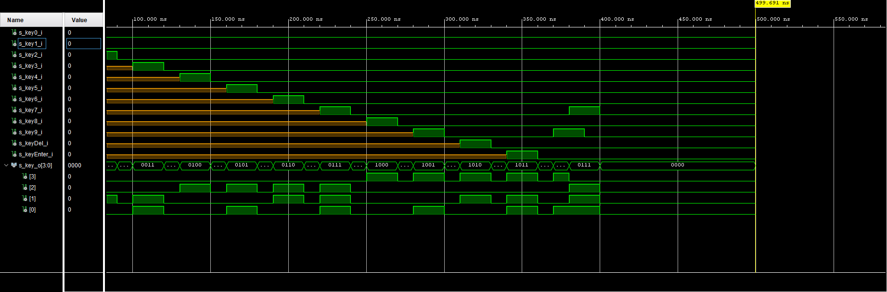

### Comparator

**Module**: The comparator accountable for showing information that is presented, meaning displaying the currently assigned PIN code, lighting a corresponding LED if the door is locked or unlocked and sending a signal to the door relay to unlock it. It’s important role is also to reset the code if the combination was incorrectly entered or when it was correct and will need to be put in the next time. Another thing is the ‘*’ key, which deletes the last number that was put in.

**Simulation**: Signals s_digit includes outcoming values into comparator. There are numbers one two three and at fourth position is as first number five then is pressed star, number five is deleted and then is written number four (the right number). After the password is entered we press a cross, each number of the display is deleted, red LED light off, green LED light on and lock is open. With the next press a cross is the lock closed. In the end of the simulation we can see the situation when we enter the wrong password and the lock does not open. 

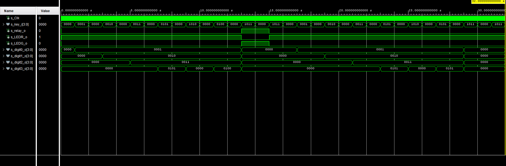

### D_7seg

**Module**: This modul just takes the input values and transforms them into 7-bit values which can be shown on the display. Switching between displays is ensured by clk modul which with 1 kHz frequency switching between every single display every 1 ns.

**Simulation**: In inputs s_data are values which were entered on the keyboard. In outputs, values for certain numbers to show on display are switching every 1 ns. 

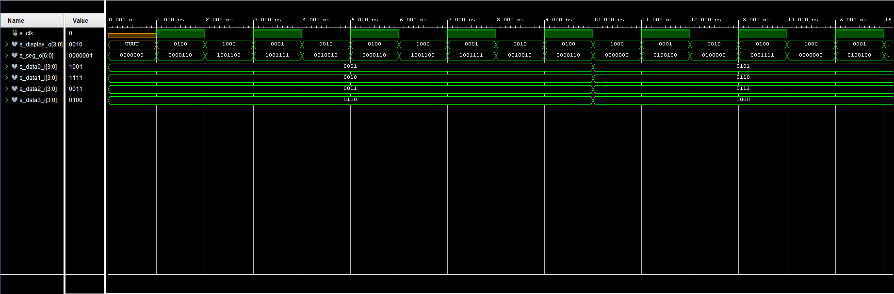

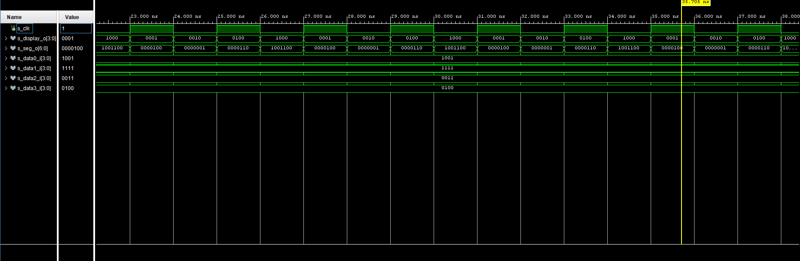

### clk

**Module**: The boards initial 100 MHz signal would be a bit overkill for the CPU. That’s why we reduce it to just 1 kHz or 1 ms intervals with this module.

**Simulation**: Here we can see that the output clock has a lower frequency.

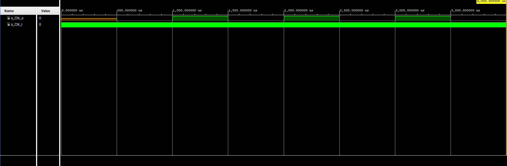
## TOP module description and simulations

### Pmod connectors:

| Output pins | FPGA pin                    | FPGA pin name |
|:-----------:|:---------------------------:|:-------------:|
| AN[3]       | IO_L13N_T2_MRCC_35          | F3            |
| AN[2]       | IO_L13P_T2_MRCC_35          | F4            |
| AN[1]       | IO_L12N_T1_MRCC_35          | D3            |
| AN[0]       | IO_L11N_T1_SRCC_35          | D4            |
| RedLED      | IO_L15N_T2_DQS_35           | G2            |
| GreenLED    | IO_L15P_T2_DQS_35           | H2            |
| Relay       | IO_L14N_T2_SRCC_35          | D2            |
| Seven_seg[0]| IO_L20P_T3_A08_D24_14       | U12           |
| Seven_seg[1]| IO_L20N_T3_A07_D23_14       | V12           |
| Seven_seg[2]| IO_L21P_T3_DQS_14           | V10           |
| Seven_seg[3]| IO_L21N_T3_DQS_A06_D22_14   | V11           |
| Seven_seg[4]| IO_L22P_T3_A05_D21_14       | U14           |
| Seven_seg[5]| IO_L22N_T3_A04_D20_14       | V14           |
| Seven_seg[6]| IO_L23P_T3_A03_D19_14       | T13           |
| key0        | IO_L16P_T2_CSI_B_14         | V15           |
| key1        | IO_L18P_T2_A12_D28_14       | U16           |
| key2        | IO_L8N_T1_D12_14            | P14           |
| key3        | IO_L19P_T3_A10_D26_14       | T11           |
| key4        | IO_L5P_T0_D06_14            | R12           |
| key5        | IO_L14P_T2_SRCC_14          | T14           |
| key6        | IO_L14N_T2_SRCC_14          | T15           |
| key7        | IO_L15N_T2_DQS_DOUT_CSO_B_14| T16           |
| key8        | IO_L11P_T1_SRCC_14          | N15           |
| key9        | IO_L10P_T1_D14_14           | M16           |
| keyDel      | IO_L18N_T2_A11_D27_14       | V17           |
| keyEnter    | IO_L17N_T2_A13_D29_14       | U18           |

 

### Diagram of the Top module

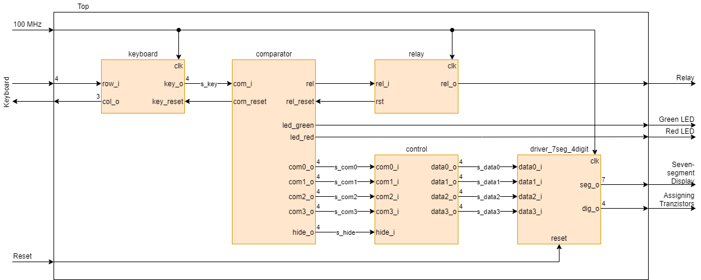

### Schematic exported from the Vivado synthesis

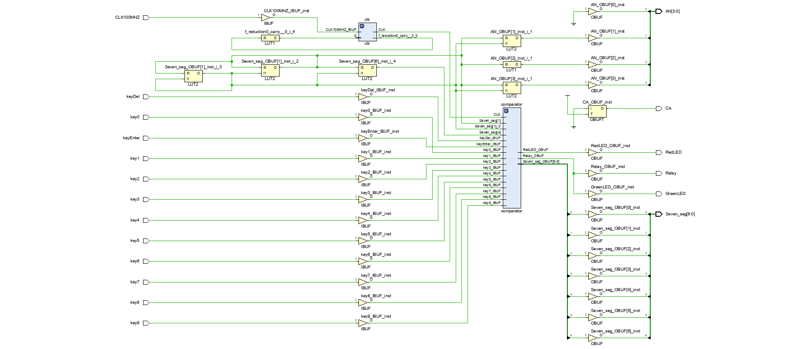

**Module**: This program consists of 4 modules. The first one being the initial *keyboard* input to which signals from its keys are conducted. After a button is pressed a signal containing a corresponding number in a binary form and is sent to the key_o output. The number ‘0’ is represented as “1111”, the ‘*’ key as “1010” and ‘#’ is “1011”. Next comes the *comparator* that is partly controlled by a *clk* signal which is transposed from being 100 MHz to just 1 kHz. Input values that are entered are stored in the comparator and after the ‘#’ key is pressed it evaluates if the code entered agrees with the set code. The module has a realy_o output that has a value of 1 when the code is correct and therefore unlocks the door. The two LEDs, one red that shines if the door is locked and a green one working the other way around. The outputs from the comparator are also data of entered values which are then sent to the driver for 7-segment displays and are presented after the matter.

**Simulation**: We simulate enter of the numbers 1, 2 and 3, after which we add a 5 that is then deleted with ‘*’ key (s_keyDel in code) and number 4 is pressed instead. The ‘#’ key confirms our input, switches on the relay to unlock the door and changes the LED color. After that we click the ‘#’ key once more to switch the relay off and return the original LED color back. The other instances are to demonstrate a wrongly inserted code when the relay and LEDs don’t react.

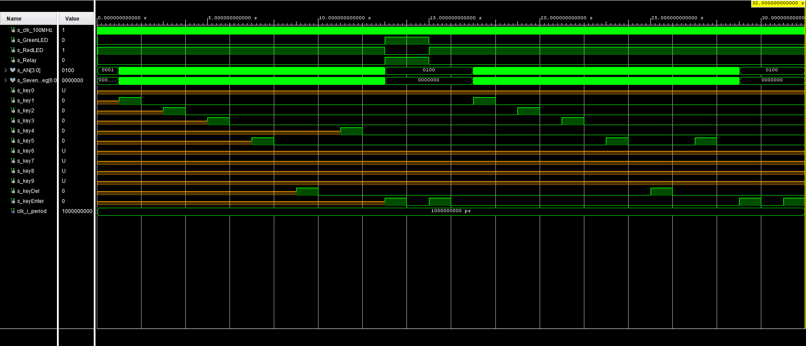

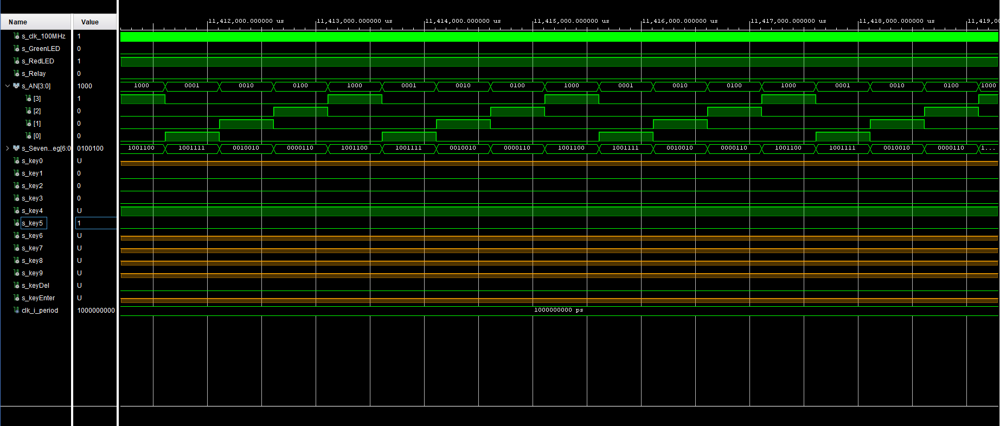

## Video

[YouTube video for Door Lock - DE1 Project](https://youtu.be/IV2hTCzT9uw)

## References

- Arty A7 Reference Manual [online]. Available from: https://reference.digilentinc.com/reference/programmable-logic/arty-a7/reference-manual
- https://www.gme.cz/led-display-14-2mm-hdsp-h101
- https://www.ics.uci.edu/~jmoorkan/vhdlref/