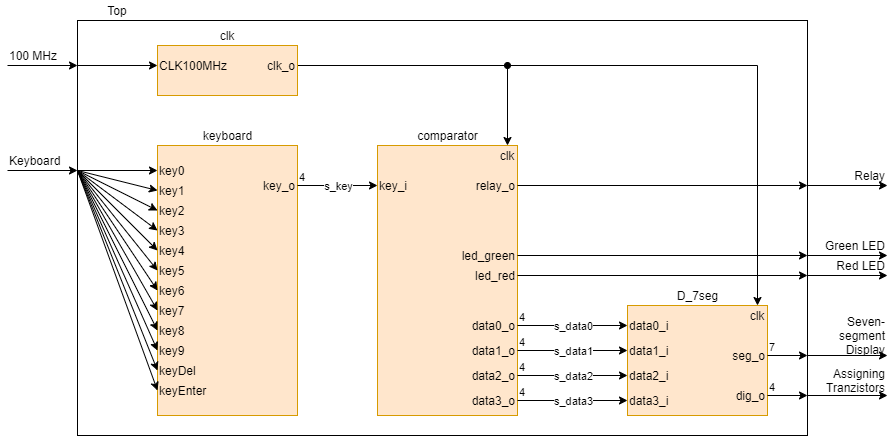

# Door Lock - DE1 Project
School project - A door lock with an Arty board

### Team members

- Medek Petr
- Navrátil Jiří
- Niederle Vojtěch
- Nimrichter Filip

[Link to our GitHub project folder](https://github.com/GeorgeNavratil/Door_Lock-DE1_Project)

### Project objectives

Making a Door Lock system with:

- 4-digit PIN terminal
- 4-digit 7-segment display
- 4x3 push buttons keyboard
- relay for door lock control

## Hardware description

Whole system will be mainly run on an [Arty A7-35T board](https://store.digilentinc.com/arty-a7-artix-7-fpga-development-board/) with a custom number keypad keyboard, a 4-digit display and a relay to automatically lock the door.

## VHDL modules description and simulations

### Keyboard

**Modul**: This module cares about the function of the keyboard. The keyboard itself is connected with seven signals where three of them go from the block to the columns of the keyboard and the other four are going back to the block from the rows. There is one 4bit vector output which gets the result of the row and column combination values. Two input ports clk and key_reset are implemented to take care of the process to run as intended.

**Simulation**:

### Comparator

**Modul**:

**Simulation**:

### Relay

**Modul**: Function of the relay module is just to let the lock open (the relay is switched on)  for some time after which it locks the door.

**Simulation**:

### Control

**Modul**: Control decides if the code numbers will be displayed or if they will be hidden behind commas.

**Simulation**:

### driver_7seg_4digit

**Modul**: This module is a combination of three blocks taken from assignments (clock_enable, cnt_up_down, hex_7seg) which include the process p_mux. Its function is to take input values from the control block and display them value by value 

**Simulation**:

## TOP module description and simulations

<!-- Start of a comment

## Video

End of a comment -->

## References

- Arty A7 Reference Manual [online]. Available from: https://reference.digilentinc.com/reference/programmable-logic/arty-a7/reference-manual
- 4X3 KEYPAD OPERATING MECHANISM » PIJA Education. WHAT IS ARDUINO? & Arduino Boards » PIJA Education [online]. Available from: https://pijaeducation.com/arduino/keypad/4x3-keypad-operating-mechanism/
- How to interface 4x3 (Alphanumeric) keypad with Arduino uno : Arduino Alphanumeric keypad programming. Electronic Projects, Electrical Engineering Resources and Makers Articles [online]. Copyright © 2021 WTWH Media LLC. All Rights Reserved. The material on this site may not be reproduced, distributed, transmitted, cached or otherwise used, except with the prior written permission of WTWH Media. Available from: https://www.engineersgarage.com/arduino/alphanumeric-keypad-with-arduino/

